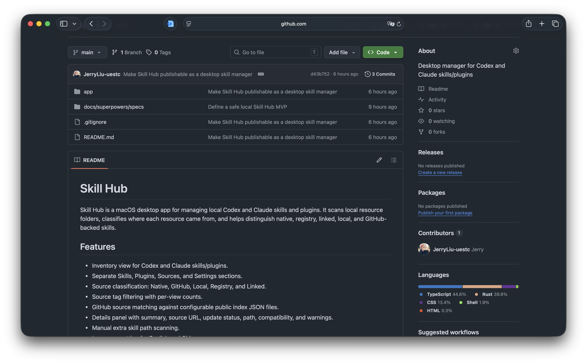

# Skill Hub

[中文](README.md) · [English](README.en.md)



Skill Hub 是一款用于管理本地 Codex 与 Claude skills 和 plugins 的 macOS 桌面应用。它会扫描本地资源目录，判断每个资源的来源，帮你区分官方、GitHub 和本地 skill。

## 功能

- Codex 与 Claude 的 skills/plugins 资源库视图。
- 独立的 Skills、Plugins、市场（Market）、设置（Settings）分区。
- 来源分类：官方、GitHub、本地。
- 按来源标签筛选，并显示各视图下的数量。
- 对照可配置的公开索引 JSON 文件做 GitHub 来源匹配。
- GitHub 市场：直接从 GitHub 仓库发现 skill 和 plugin（无需别人预先发布索引），并内置官方与社区目录，首次打开市场就有内容。
- 市场顶部可在 **插件** 与 **Skill** 之间切换；“已添加”区域展示当前类型在本机已安装的资源总数与预览。
- 市场预热与缓存：应用启动后会在后台慢慢预热市场，结果本地缓存 30 分钟；只有用户明确点击刷新时才会重新向 GitHub 拉取。
- 粘贴任意 GitHub 仓库、skill 链接或 plugin 链接，自动发现并安装其中的资源。
- 排行榜：按来源仓库的 star 数排序市场，前几名带名次徽章。市场结果较多时会分批渲染，避免切到市场页时一次性卡住。
- 刷新市场时显示 Rose Three 动态加载器，并逐个显示市场源加载状态。
- 通过对比远程 `SKILL.md` 哈希，检测来自 GitHub 的 skill 是否有更新。
- 应用内更新检测：可从 GitHub Releases 拉取 `latest.json` 并安装已签名的更新包。
- 详情面板展示摘要、来源 URL、更新状态、路径和兼容性。
- 手动添加额外的 skill 扫描路径。
- 中英文界面语言设置。
- 深色与浅色主题。
- 本地安装流程：直接替换 `/Applications/Skill-Hub.app`，无需每次都通过 DMG 重新安装。

## 扫描机制

Skill Hub 默认扫描以下根目录：

- `~/.codex/skills`
- `~/.codex/plugins`
- `~/.claude/skills`
- `~/.claude/plugins`

你可以在设置里添加额外的 skill 根目录。包含 `SKILL.md` 的目录会被视为 skill；Codex 插件通过 `.codex-plugin/plugin.json` 识别，Claude 插件通过 `plugin.json` 识别。

界面上的来源分类按以下顺序判断：

1. GitHub：`.git/config`、`SKILL.md` frontmatter，或匹配到的 GitHub 索引元数据。
2. 官方：Codex 系统 skill、内置插件内容，或整理过的插件缓存内容。
3. 本地（Local）：手动添加、自定义，或未匹配到 GitHub 来源的外部资源。

## GitHub 来源匹配

GitHub 匹配在设置里默认关闭，需手动开启。开启后，Skill Hub 会下载一个或多个公开索引 JSON 文件，并在本地与已安装的 skill 进行对比。本地 skill 文件和路径不会被上传。

索引可以是数组形式：

```json
[
  {
    "name": "ppt-master",
    "repository": "https://github.com/example/ppt-master",
    "description": "AI-driven multi-format SVG content generation system.",
    "skillSha256": "optional-sha256-of-SKILL.md"
  }
]
```

也可以包在 `skills` 字段里：

```json
{
  "skills": [
    {
      "name": "ppt-master",
      "repository": "https://github.com/example/ppt-master"
    }
  ]
}
```

匹配置信度：

- `GitHub verified`（已验证）：`SKILL.md` 的 SHA-256 与索引一致。
- `GitHub probable`（可能匹配）：名称与描述与索引一致。

## GitHub 市场

市场会**直接从 GitHub 仓库发现 skill 和 plugin** —— 不需要别人预先发布索引文件。它始终会展示内置目录（即使离线或被限速也有内容），再加上从你配置的**市场源**里发现的全部资源。首次安装会预置三个默认源：

- [`anthropics/skills`](https://github.com/anthropics/skills)
- [`obra/superpowers`](https://github.com/obra/superpowers)
- [`anthropics/claude-plugins-official`](https://github.com/anthropics/claude-plugins-official)

市场页顶部有 **插件 / Skill** 两个 tab。当前 tab 下的“已添加”区域不是只看市场源命中的条目，而是直接来自本地资源库：Skill tab 会展示本机已安装的 skill 总数，Plugin tab 会展示本机已安装的 plugin 总数，并提供前几个资源预览和跳转到本地资源页的管理入口。

市场加载和打开市场页是解耦的：

- 应用启动后，Skill Hub 会在本地资源库开始加载后延迟进行后台市场预热。
- 如果本地有有效缓存，市场会直接使用缓存，不会再请求 GitHub。
- 市场缓存有效期为 30 分钟，并且会按当前市场源列表区分。
- 打开市场页不会触发 GitHub 刷新；只有点击 **刷新** 才会强制重新拉取。
- 市场列表会按批次显示，避免发现很多资源时一次性渲染导致卡顿；刷新过程中会显示 Rose Three 动态加载器和每个市场源的加载状态。

发现一个仓库的流程：

1. 调用一次 `git/trees?recursive=1` GitHub API，列出仓库里所有 `SKILL.md` 与插件 manifest 路径。
2. 每个资源的名称和描述走 `raw.githubusercontent.com` 读取（不限速）。
3. 调用一次仓库元数据接口，附上 star 数。

条目按仓库 URL 去重；当本地某个资源在来源 URL、`SKILL.md` 哈希或名称上能匹配上时，会被标记为已安装。

**粘贴链接。** 在市场顶部的单输入框里粘贴任意 GitHub 仓库链接（`https://github.com/owner/repo`）或具体资源链接（`.../tree/<branch>/skills/<名称>`、`.../tree/<branch>/plugins/<名称>` 等），点击 **发现**。发现到的资源会并入市场，该仓库也会被记为源供下次刷新。需要新增长期市场源时，点击搜索框旁边的加号。

**排行榜。** 市场可按 **Star 数**（默认）或 **名称** 排序，前三名带名次徽章。star 是*来源仓库*的 star —— GitHub 没有 skill 粒度的指标，所以同一仓库下的多个 skill 共享这个数字（star 上有 tooltip 说明这一点）。

从市场安装：

1. 选择安装的目标主机（Codex 或 Claude）。
2. 在卡片上点击 **安装**。

Skill Hub 会通过 HTTPS 从 `codeload.github.com` 下载仓库 tarball，解压到临时目录，定位到对应的 skill 或 plugin（当 URL 带有 `/tree/<branch>/<subpath>` 时会按子路径定位），然后拷贝到目标主机对应的 `skills` 或 `plugins` 目录。

每次安装都会经过与应用其余部分一致的安全护栏：

- 只接受公开的 GitHub HTTPS/SSH URL。
- 永远不会拷贝敏感文件（`.env`、`*.pem`、`*.key`，以及任何包含 `token`/`secret`/`credential` 的文件）。
- 写入被限定在主机根目录内，且绝不覆盖已存在的目标（遇到同名会以名称冲突报错，而不是覆盖）。

### 速率限制与可选 Token

匿名 GitHub API 一小时只有 **60 次**，发现功能很容易把它用光。如果首次打开市场显示偏空，通常就是撞到了限速（内置官方目录无论如何都会显示）。在 **设置 → GitHub Token** 里填一个个人访问令牌，可把限制提升到 5000 次/小时。Token 仅保存在本地，除了作为 GitHub API 调用的 `Authorization` 头之外不会上传到任何地方。单个源失败（限速或网络问题）不会导致整个市场失败 —— 其他源和内置目录仍会照常加载。

## 更新检测

对任意来自 GitHub 的 skill，详情面板都会提供 **检查更新** 操作。Skill Hub 会抓取远程的 `raw.githubusercontent.com/.../SKILL.md`（从来源 URL 解析分支与子路径，并在 `main` 取不到时回退到 `master`），计算其哈希，再与本地的 `SKILL.md` 对比：

- `已是最新`：本地与远程哈希一致。
- `有可用更新`：哈希不一致。
- `无法判断`：读取不到远程 `SKILL.md`。

当有可用更新时，**更新** 操作会先把新副本下载并校验到临时目录，再把现有 skill 移入系统废纸篓，然后安装新副本。如果下载或校验失败，已安装的 skill 保持原样不动；旧副本始终是移入废纸篓，而不会被永久删除。

## 应用更新

应用内的 **检查应用更新** 按钮会读取 GitHub Releases 中的 `latest.json`。构建发布包时，Tauri 会生成 updater tarball 和签名文件；随后运行：

```bash
cd app
npm run release:latest-json
```

脚本会根据当前 `tauri.conf.json` 版本和 updater 签名生成 `src-tauri/target/release/bundle/macos/latest.json`，可随 `Skill-Hub.app.tar.gz` 与 `.sig` 一起上传到 GitHub Release。

## 开发

环境要求：

- Node.js
- Rust
- 打包 Tauri 应用需要 macOS

安装依赖：

```bash
cd app
npm install
```

启动 Vite 开发服务器：

```bash
npm run dev
```

这会在 `http://127.0.0.1:1420/` 启动浏览器开发版界面，但不会更新已经安装到 `/Applications` 的 macOS App。

运行检查：

```bash
npm run test
npm run lint
npm run format:check
cd src-tauri && cargo test
```

构建应用 bundle：

```bash
npm run build:app
```

把最新的本地构建安装到 `/Applications`：

```bash
npm run install:local
```

只要希望已安装的桌面应用（`/Applications/Skill-Hub.app`）反映本地代码改动，就要运行这个命令。脚本会构建 Tauri bundle，退出当前正在运行的 Skill Hub，替换 `/Applications/Skill-Hub.app`，尽量清除 quarantine 元数据，然后重新打开应用。

如果 `http://127.0.0.1:1420/` 里的浏览器页面已经变了，但桌面 App 没变，说明你看到的是两个不同运行入口。运行 `npm run install:local` 并重新打开桌面 App。

构建桌面发布产物：

```bash
npm run build:desktop
```

## 仓库结构

- `app/src`：React 界面。
- `app/src-tauri/src`：负责扫描、来源匹配、安装与删除的 Tauri/Rust 后端。
- `app/scripts`：本地安装与 DMG 后处理脚本。
- `app/src/*.test.tsx` 与 `app/src/*.test.ts`：前端测试。
- `app/src-tauri/src/lib.rs`：后端逻辑与 Rust 测试。

## 隐私说明

GitHub 匹配默认关闭。开启后，应用会下载已配置的索引 URL 并在本地完成匹配。它不会上传本地 skill 目录、文件内容或路径。
